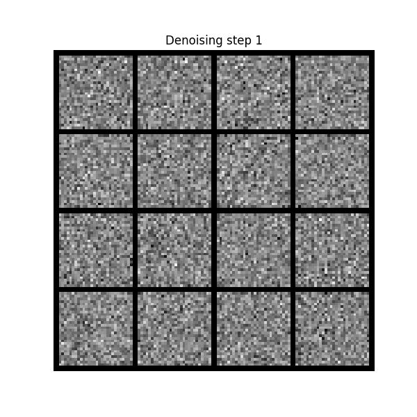

# Simple Diffusion Models
Building simple diffusion models for image generation. More so for understanding and learning.

## Simple script to train and evaluate a tiny U-Net model on CIFAR-10 and MNIST.

### Train Command
```
python diffusion_tinyunet_mnist_cifar10.py --dataset "mnist" --batch_size 64 --epochs 100 --lr 1e-3 --log_interval 100
```

### Test Command
```
python diffusion_tinyunet_mnist_cifar10.py --dataset "mnist" --inference --num_samples 16
```

### Random Qualitative Results on MNIST

|  |  |  |  |  |
|-------------------------------|-------------------------------|-------------------------------|-------------------------------|-------------------------------|
|  |  |  |  |  |


Easy peasy lemon squeezey &#x1F34B;
